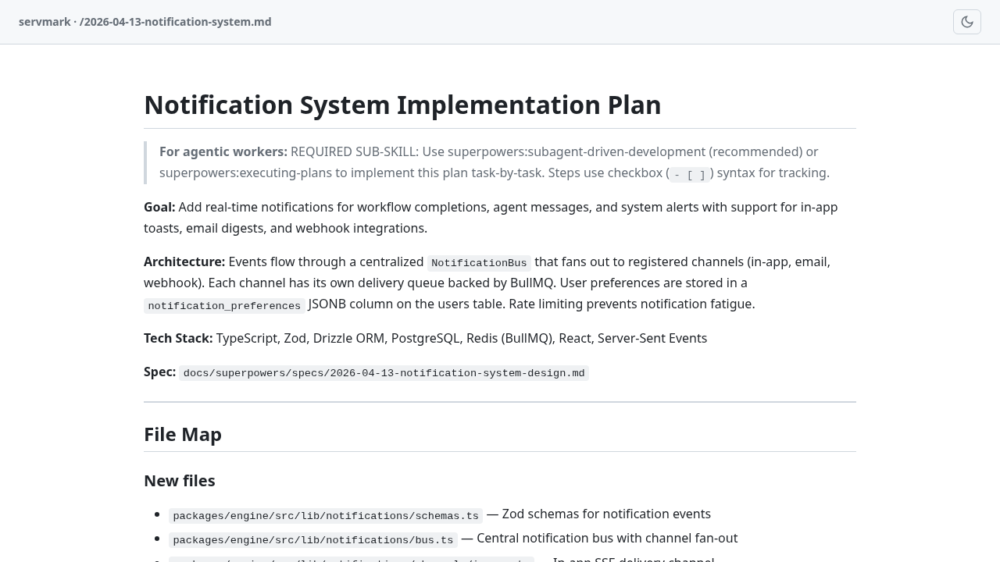
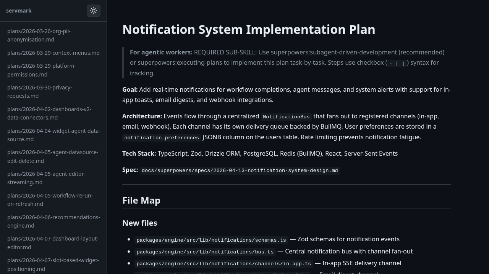

# servmark

A fast local file server with built-in markdown rendering, syntax highlighting, and live reload.

Serve any directory and browse its contents. Markdown files are rendered with GitHub-flavored styling, Shiki syntax highlighting (light + dark themes), and task list support. Optionally enable **docs mode** to get a sidebar listing all `.md` files for quick navigation.





## Install

```bash
npm install -g servmark
```

Or run directly with npx:

```bash
npx servmark
```

## Usage

```bash
# Serve the current directory
servmark

# Serve a specific directory
servmark ./docs

# Docs mode --- adds a sidebar listing all markdown files
servmark --docs ./docs

# Force dark or light theme
servmark --dark ./docs
servmark --light ./docs

# Custom port
servmark -p 8080 ./docs

# Disable auto-opening the browser
servmark --no-browser ./docs

# Disable live reload
servmark --no-reload ./docs
```

## Features

- **Markdown rendering** --- GitHub-flavored markdown with inline code, blockquotes, tables, and task lists
- **Syntax highlighting** --- Powered by [Shiki](https://shiki.style) with `github-light` and `github-dark` themes
- **Docs mode** --- Sidebar navigation listing all `.md` files in the directory tree
- **Dark / light theme** --- Toggle with a button, persisted in localStorage, or force via CLI flags
- **Live reload** --- File changes are pushed over SSE and swapped into the page without a full reload
- **Static file serving** --- Serves images, fonts, PDFs, videos, and other static assets with correct MIME types
- **Directory browsing** --- Navigate folder contents with file sizes and modification dates
- **Path traversal protection** --- Requests are normalized and validated to prevent directory escape

## License

MIT
